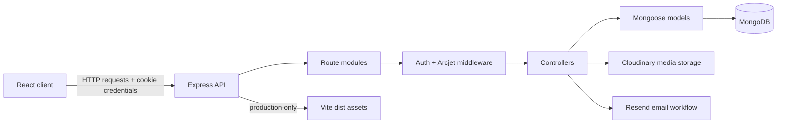

# Chatify

Chatify is a full-stack messaging application foundation built around an Express/MongoDB API and a React/Vite client. The backend implements the core identity, session, contact discovery, security middleware, and several production integration paths, with profile media and static frontend serving partially wired. The frontend is currently a Vite React application shell prepared for the product UI and API integration work.

This repository is structured as a compact full-stack monorepo: one deployable Node backend, one independently built React frontend, and a root build script that installs both workspaces and emits the production client bundle.

## System Overview



## Architecture at a Glance

| Layer | Implementation | Responsibility |
| --- | --- | --- |
| Client | React 19, Vite 8 | Browser application shell, component rendering, static asset bundling |
| API | Express 4 | Request routing, JSON parsing, cookie parsing, production asset serving path |
| Auth | JWT, HTTP-only cookies, bcrypt | Signup, login, logout, protected route identity hydration |
| Data | MongoDB, Mongoose | User and message persistence with schema-level constraints |
| Security | Arcjet, cookie flags, password hashing | Rate limiting, bot inspection, attack shielding, credential protection |
| Media | Cloudinary | Profile image upload and hosted image URL storage |
| Email | Resend client configuration | Welcome email template and async post-signup workflow |

## Repository Layout

```text
chatify/
  backend/
    src/
      controllers/        # Request handlers for auth and messaging domains
      emails/             # Email templates and workflow handlers
      lib/                # Environment, database, JWT, Cloudinary, Arcjet, Resend setup
      middleware/         # Auth guard and Arcjet request protection
      models/             # Mongoose schemas
      routes/             # Express route modules
      server.js           # API bootstrap and production static hosting
  frontend/
    src/
      App.jsx             # Current React shell
      main.jsx            # React root bootstrap
      App.css             # App-level styling
      index.css           # Global tokens and base styles
    vite.config.js
  package.json            # Full-stack build/start orchestration
```

## Implemented Capabilities

| Capability | Status | Notes |
| --- | --- | --- |
| User signup | Implemented | Validates required fields, email format, password length, duplicate email, then hashes password |
| User login | Implemented | Verifies email/password and issues a JWT cookie |
| Logout | Implemented | Clears the auth cookie |
| Session persistence | Implemented | Protected routes read and verify the `token` cookie |
| Contact discovery | Implemented | Returns all users except the authenticated user |
| Message persistence model | Implemented | `Message` schema supports sender, receiver, text, image, timestamps |
| Profile image upload | Partially wired | Controller contains Cloudinary upload flow; see backend README for implementation note |
| Welcome email | Partially wired | Template and payload builder exist; outbound Resend send call is not currently invoked |
| Frontend product UI | Scaffolded | Vite starter UI is present; routing, state, and API client are not yet implemented |
| Production static serving | Partially wired | `server.js` contains the static-serving branch; `ENV.NODE_ENV` must be exposed by `lib/env.js` for the branch to activate |

## Backend Summary

The backend follows a conventional MVC-style Express layout:

- Routes define the public HTTP contract under `/api/auth` and `/api/messages`.
- Middleware performs cross-cutting request work such as cookie-based authentication and Arcjet inspection.
- Controllers own request validation, persistence orchestration, token issuing, media uploads, and response shaping.
- Models define MongoDB persistence contracts through Mongoose schemas.
- `lib/` centralizes infrastructure clients and environment access.

Production serving is structured to run through Express. When the production environment branch is active, the backend serves `frontend/dist` and falls back to `index.html` for client-side navigation. The current `server.js` checks `ENV.NODE_ENV`, so `lib/env.js` should expose `NODE_ENV` before relying on this branch in deployment.

## Frontend Summary

The frontend is a React/Vite application with:

- React 19 rendering via `createRoot`
- Vite development, build, and preview scripts
- Global CSS tokens for light/dark themes
- A responsive starter layout in `App.jsx`

The current client does not yet include application routing, API calls, auth state, protected views, or chat screens. Those are the natural next integration points for the backend API already present in the repository.

## API Surface

| Method | Path | Auth | Purpose |
| --- | --- | --- | --- |
| `POST` | `/api/auth/signup` | Public | Create an account and issue a session cookie |
| `POST` | `/api/auth/login` | Public | Authenticate and issue a session cookie |
| `POST` | `/api/auth/logout` | Public | Clear the session cookie |
| `PUT` | `/api/auth/update-profile` | Required | Upload and persist a profile image URL |
| `GET` | `/api/messages/contacts` | Required | Return all contacts except the authenticated user |

## Environment Variables

Create `backend/.env` with:

```env
PORT=5000
NODE_ENV=development
MONGO_URI=mongodb+srv://...
JWT_SECRET=replace-with-a-long-random-secret

CLIENT_URL=http://localhost:5173

CLOUDINARY_CLOUD_NAME=...
CLOUDINARY_API_KEY=...
CLOUDINARY_API_SECRET=...

RESEND_API_KEY=...
EMAIL_FROM=...
EMAIL_FROM_NAME=Chatify

ARCJET_API_KEY=...
ARCJET_ENV=development
```

## Local Development

Install dependencies:

```bash
npm install --prefix backend
npm install --prefix frontend
```

Run the backend:

```bash
npm run dev --prefix backend
```

Run the frontend:

```bash
npm run dev --prefix frontend
```

The backend defaults to `http://localhost:5000`. Vite typically serves the frontend at `http://localhost:5173`.

The current backend does not configure CORS or a Vite proxy. For browser-to-API calls during local frontend development, add either an Express CORS policy with credentials or a Vite dev proxy. In production, Express serves the built frontend from the same origin.

## Production Build

From the repository root:

```bash
npm run build
npm start
```

The root build command installs backend dependencies, installs frontend dependencies, and builds the Vite bundle. The root start command launches the backend. The backend is structured to serve the compiled frontend in production once `ENV.NODE_ENV` is wired through the environment module.

## Engineering Highlights

- HTTP-only cookie sessions keep JWTs out of browser JavaScript.
- Passwords are salted and hashed with bcrypt before persistence.
- Mongoose schemas enforce core persistence contracts and timestamps.
- Arcjet is integrated at the auth router boundary for rate limiting, bot detection, and shield inspection.
- The server is deployable as a single Node process that hosts both API and static frontend assets in production.
- Infrastructure integrations are isolated behind small `lib/` modules, keeping controllers focused on product workflows.

## Scalability Notes

The current codebase is a clean base for expanding into a real-time messaging system. The message model already separates sender and receiver identities, and the controller/route structure leaves room for conversation retrieval, message sending, pagination, WebSocket delivery, and media attachment workflows.

Recommended next production steps:

- Add a frontend API client with credentialed requests.
- Add conversation and message send/read endpoints around the existing `Message` model.
- Add WebSocket or Server-Sent Events support for real-time delivery.
- Add centralized error handling and request validation middleware.
- Add automated API and component tests.
- Add MongoDB indexes for high-volume contact and message access patterns.
