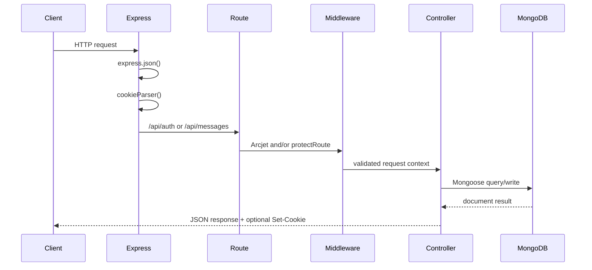

# Chatify Backend

The Chatify backend is an Express/MongoDB API responsible for identity, session management, contact discovery, profile media handling, security middleware, and the production static-delivery path for the React client.

It is organized as a small MVC-style service: route modules define the HTTP surface, middleware handles cross-cutting request concerns, controllers coordinate business workflows, models define persistence contracts, and `lib/` modules encapsulate infrastructure clients.

## Runtime Stack

| Concern | Technology |
| --- | --- |
| HTTP server | Express 4 |
| Runtime | Node.js 18+, native ES modules |
| Database | MongoDB with Mongoose 8 |
| Authentication | JWT stored in HTTP-only cookies |
| Password security | bcryptjs |
| Request security | Arcjet shield, bot detection, sliding-window rate limit |
| Media | Cloudinary |
| Email infrastructure | Resend client configuration |
| Configuration | dotenv-backed environment module |

## Source Layout

```text
src/
  server.js                    # Express bootstrap, route mounting, production static-serving branch
  controllers/
    auth.controller.js         # Signup, login, logout, profile image update
    message.controller.js      # Authenticated contact discovery
  routes/
    auth.route.js              # /api/auth endpoints with Arcjet protection
    messages.route.js          # /api/messages endpoints
  middleware/
    auth.middleware.js         # JWT cookie verification and req.user hydration
    arcjet.middleware.js       # Arcjet decision handling
  models/
    User.js                    # User identity and profile schema
    Message.js                 # Direct message persistence schema
  lib/
    arcjet.js                  # Arcjet ruleset
    cloudinary.js              # Cloudinary SDK configuration
    db.js                      # MongoDB connection lifecycle
    env.js                     # Environment variable access
    resend.js                  # Resend client and sender identity
    utils.js                   # JWT generation and cookie issuing
  emails/
    emailHandlers.js           # Welcome email workflow entry point
    emailTemplates.js          # HTML welcome email template
```

## Request Lifecycle



Global middleware:

- `express.json()` parses JSON request bodies.
- `cookieParser()` exposes `req.cookies.token` for cookie-based session validation.

Route-level middleware:

- `arcjetProtection` is mounted for every `/api/auth/*` request.
- `protectRoute` is mounted on authenticated profile and contact endpoints.

## Route Organization

| Router | Base Path | Middleware | Responsibility |
| --- | --- | --- | --- |
| `auth.route.js` | `/api/auth` | `arcjetProtection`, endpoint-level `protectRoute` | Account creation, login, logout, profile update |
| `messages.route.js` | `/api/messages` | endpoint-level `protectRoute` | Authenticated contact discovery |

Commented routes in `messages.route.js` indicate planned chat retrieval and message sending endpoints, but they are not currently exposed by the API.

## Authentication Architecture

Chatify uses stateless JWT sessions stored in an HTTP-only cookie named `token`.

### Token Issuing

`generateToken` signs a JWT with:

- payload: `{ id: user._id }`
- secret: `ENV.JWT_SECRET`
- expiration: `7d`
- cookie max age: `7 * 24 * 60 * 60 * 1000`
- cookie flags: `httpOnly`, `sameSite: "strict"`, `secure` outside development

The cookie strategy keeps the token unavailable to browser JavaScript and allows protected routes to authenticate through normal browser cookie behavior.

### Protected Request Flow

1. Client sends request with the `token` cookie.
2. `protectRoute` reads `req.cookies.token`.
3. Middleware verifies the token with `JWT_SECRET`.
4. Middleware loads the user from MongoDB and excludes `password`.
5. The sanitized user document is assigned to `req.user`.
6. The controller executes with authenticated user context.

Unauthorized requests return `401` when the token is missing or invalid. Unexpected middleware failures return `500`.

### Current Implementation Note

`generateToken` expects a user document-like object with an `_id` property. The signup and login controllers currently pass `savedUser._id` and `user._id` into `generateToken`, which means the helper receives an ObjectId rather than a user object. Before production use, either pass the full user document or update `generateToken` to sign the ObjectId directly.

## Security Architecture

### Arcjet

`lib/arcjet.js` configures three rules:

| Rule | Mode | Behavior |
| --- | --- | --- |
| `shield` | `DRY_RUN` | Inspects common attack patterns without blocking |
| `detectBot` | `DRY_RUN` | Detects bots while allowing search engines |
| `slidingWindow` | `LIVE` | Blocks after 5 requests per 60 seconds |

`arcjet.middleware.js` translates Arcjet decisions into API responses:

- `429` for rate limit denial
- `403` for bot denial
- `403` for spoofed bot detection
- `403` for generic security policy denial

Arcjet is currently attached to the auth router, which protects signup/login/logout/profile-update traffic. Message routes do not currently run through Arcjet.

### Credential Handling

- Passwords are never stored in plaintext.
- Signup hashes passwords with bcrypt salt rounds of `10`.
- Login compares submitted credentials with `bcrypt.compare`.
- User responses intentionally exclude the password hash.
- `protectRoute` queries users with `.select("-password")`.

### Cookie Security

The JWT cookie uses:

- `httpOnly: true` to reduce token exposure through XSS.
- `sameSite: "strict"` to reduce cross-site request forgery risk.
- `secure: true` outside development so cookies are sent only over HTTPS in production.

Because the session model is cookie-based, any future cross-origin frontend integration must enable credentialed requests and a narrowly scoped CORS policy.

## Database Design

### User Model

```js
{
  email: String,       // required, unique, trim, lowercase
  fullname: String,    // required
  password: String,    // required, minlength 6, bcrypt hash
  profilePic: String,  // defaults to ""
  createdAt: Date,
  updatedAt: Date
}
```

Design notes:

- `email` is normalized to lowercase and uniquely indexed by Mongoose.
- `timestamps` provide audit metadata for account lifecycle events.
- The stored password is a hash, not a recoverable credential.

### Message Model

```js
{
  senderId: ObjectId<User>,
  receiverId: ObjectId<User>,
  text: String,
  image: String,
  createdAt: Date,
  updatedAt: Date
}
```

The schema supports direct user-to-user messages with optional text and optional image payloads. Query endpoints for chat history and message creation are not currently implemented, but the schema is ready for:

- compound indexes on `{ senderId, receiverId, createdAt }`
- cursor pagination by `createdAt` or `_id`
- image attachment delivery through Cloudinary-hosted URLs

## Controller Responsibilities

### `auth.controller.js`

| Function | Responsibility |
| --- | --- |
| `signup` | Validate input, enforce password/email rules, prevent duplicate accounts, hash password, create user, issue cookie, trigger welcome email workflow |
| `login` | Validate input, verify credentials, issue cookie, return sanitized user |
| `logout` | Clear the `token` cookie |
| `updateProfile` | Require profile image payload, upload to Cloudinary, persist hosted image URL |

### `message.controller.js`

| Function | Responsibility |
| --- | --- |
| `getAllContacts` | Return all users except the authenticated requester, excluding password hashes |

## Media Handling

Cloudinary is configured in `lib/cloudinary.js` from environment variables:

- `CLOUDINARY_CLOUD_NAME`
- `CLOUDINARY_API_KEY`
- `CLOUDINARY_API_SECRET`

The intended profile image flow is:

1. Authenticated client sends `profilePic` in the request body.
2. Controller uploads the image to `chatify/profilePics`.
3. Cloudinary returns a hosted `secure_url`.
4. User document is updated with the new `profilePic` URL.
5. API returns the sanitized updated user.

Current implementation note: `updateProfile` assigns the upload result to `uploadRespobse` but later reads `uploadResponse.secure_url`. Fixing that variable mismatch is required for the endpoint to complete successfully.

## Email Workflow

Signup calls `sendWelcomeEmail(savedUser.email, savedUser.fullname, ENV.CLIENT_URL)` after returning the account creation response. The call is wrapped in its own `try/catch`, so email failure does not fail signup.

This is the right fault boundary for onboarding email: account creation remains the primary transaction, while notification delivery is best-effort.

Current implementation note: `emailHandlers.js` builds the Resend email payload but does not currently call `resendClient.emails.send(data)`. The Resend client and sender identity are configured in `lib/resend.js`.

## API Documentation

### `POST /api/auth/signup`

Creates a user and issues a session cookie.

Request:

```json
{
  "fullname": "Ada Lovelace",
  "email": "ada@example.com",
  "password": "secret123"
}
```

Success response:

```json
{
  "message": "User created successfully",
  "user": {
    "id": "mongodb-object-id",
    "fullname": "Ada Lovelace",
    "email": "ada@example.com",
    "profilePic": ""
  }
}
```

Validation responses:

- `400` when required fields are missing
- `400` when password length is less than 6
- `400` when email format is invalid
- `400` when the user already exists

### `POST /api/auth/login`

Authenticates credentials and issues a session cookie.

Request:

```json
{
  "email": "ada@example.com",
  "password": "secret123"
}
```

Success response:

```json
{
  "message": "Login successful",
  "user": {
    "id": "mongodb-object-id",
    "fullname": "Ada Lovelace",
    "email": "ada@example.com",
    "profilePic": ""
  }
}
```

### `POST /api/auth/logout`

Clears the session cookie.

Success response:

```json
{
  "message": "Logout successful"
}
```

### `PUT /api/auth/update-profile`

Requires authentication.

Request:

```json
{
  "profilePic": "data:image/png;base64,..."
}
```

Success response shape:

```json
{
  "message": "Profile updated successfully",
  "user": {
    "id": "mongodb-object-id",
    "fullname": "Ada Lovelace",
    "email": "ada@example.com",
    "profilePic": "https://res.cloudinary.com/..."
  }
}
```

### `GET /api/messages/contacts`

Requires authentication.

Returns every user except the authenticated requester, with password hashes excluded.

Success response:

```json
[
  {
    "_id": "mongodb-object-id",
    "fullname": "Grace Hopper",
    "email": "grace@example.com",
    "profilePic": "",
    "createdAt": "2026-05-11T00:00:00.000Z",
    "updatedAt": "2026-05-11T00:00:00.000Z"
  }
]
```

## Environment

Required backend environment:

```env
PORT=5000
NODE_ENV=development
MONGO_URI=mongodb+srv://...
JWT_SECRET=replace-with-a-long-random-secret

CLIENT_URL=http://localhost:5173

CLOUDINARY_CLOUD_NAME=...
CLOUDINARY_API_KEY=...
CLOUDINARY_API_SECRET=...

RESEND_API_KEY=...
EMAIL_FROM=...
EMAIL_FROM_NAME=Chatify

ARCJET_API_KEY=...
ARCJET_ENV=development
```

Current implementation note: `server.js`, `utils.js`, and `auth.controller.js` read `ENV.NODE_ENV`, but `lib/env.js` does not currently include a `NODE_ENV` property. Add `NODE_ENV: process.env.NODE_ENV || "development"` before relying on production static serving or environment-specific cookie security behavior.

## Development

```bash
npm install
npm run dev
```

The development script runs `nodemon src/server.js`.

## Production

```bash
npm run start
```

For production static hosting, build the frontend first from the repository root:

```bash
npm run build
NODE_ENV=production npm run start --prefix backend
```

When the production branch is active, `server.js` serves `../frontend/dist` and returns `index.html` for unmatched routes. Because that branch currently checks `ENV.NODE_ENV`, `lib/env.js` must expose `NODE_ENV` for this behavior to activate.

## Production Engineering Notes

- Add centralized error middleware to normalize error responses and logging.
- Add request schema validation middleware for stronger API contracts.
- Add CORS configuration only if the frontend is served from a separate origin.
- Add MongoDB indexes for contacts and message history as message traffic grows.
- Add tests around auth cookies, protected routes, Arcjet denial paths, and controller validation.
- Move email delivery to an async job queue if signup volume or provider latency increases.
- Add structured logging and request IDs before production observability work.
